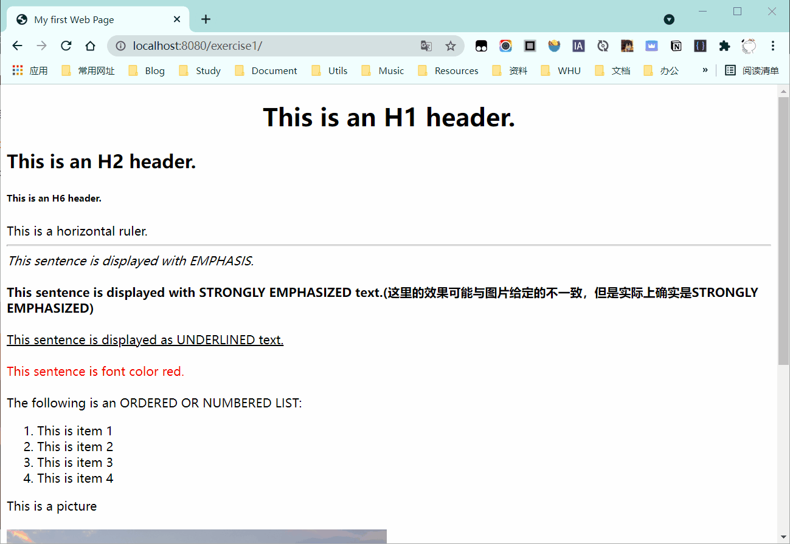

# 《软件技术基础》实验代码库

## 第一次实验

实验题目及要求：[软件技术基础第一次实验课.docx](./docs/软件技术基础第一次实验课.docx)

- 实验1：http://127.0.0.1:8080/exercise1
  
  

- 实验2：http://127.0.0.1:8080/exercise2

## 如何运行

您可以选择以下两种方式运行本实验代码：

1. 使用IDEA自动部署到Tomcat（😁推荐）
   
   1. 克隆本仓库：
       ```shell
       git clone https://github.com/SalHe/software-technology-basics.git
       ```
   2. 用IDEA Ultimate打开本仓库(是打开仓库根目录)。
   3. 启动服务。
       
       在目标中选择`TOMCAT 8.5.71`，点击运行。
       
       可能出现因为Tomcat配置不同而无法正常启动项目的情况，需要打开`Edit Configurations...`（可双击`Shift`，然后在弹出的提示框中输入`Edit Configurations...`）。

       在`Application server`中配置好本地的`Tomcat`即可。
   4. 在浏览器中输入相应实验对应的URL即可进入。

2. 直接放入Tomcat运行

    将实验相关文件放入到`Tomcat`的`webapps`文件夹中并启动`Tomcat`。然后在浏览器中进入实验代码对应的网址。