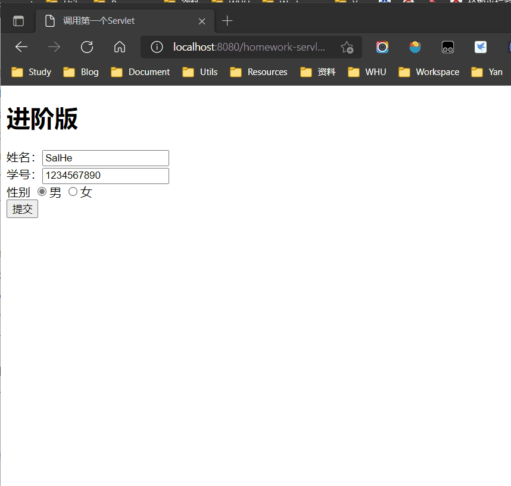

# 《软件技术基础》代码库

## 实验内容

### 项目索引页(非实验内容)

地址：http://127.0.0.1:8080/lab-index


图中的实验索引随代码更新而更新，不再更新图片。

### 第一次实验

实验题目及要求：[软件技术基础第一次实验课.pdf](./docs/软件技术基础第一次实验课.pdf)/[软件技术基础第一次实验课.docx](./docs/软件技术基础第一次实验课.docx)

- 实验1：http://127.0.0.1:8080/exercise1-1
  
  

- 实验2：http://127.0.0.1:8080/exercise1-2
  
  

### 第二次实验

实验题目及要求：[软件技术基础第二次实验课.pdf](./docs/软件技术基础第二次实验课.pdf)/[软件技术基础第二次实验课.docx](./docs/软件技术基础第二次实验课.docx)

- 实验1：http://127.0.0.1:8080/exercise2-1
  
  

- 实验2：http://127.0.0.1:8080/exercise2-2
  
  

  

### 第三次实验

实验题目及要求：

- 实验1：[第三次实验Part1.pdf](./docs/第三次实验Part1.pdf)/[第三次实验Part1.docx](./docs/第三次实验Part1.docx)

- 实验2：[第三次实验Part2.pdf](./docs/第三次实验Part2.pdf)/[第三次实验Part2.docx](./docs/第三次实验Part2.docx)

实验代码运行效果截图：

- 实验1：（无对应网页）

  

- 实验2：

  

  上述效果图可能由于动物和花的图片太大导致不太好看到背景，所以建议可以运行查看效果。

## 作业内容

### 10月25日作业：编写Servlet并使用

- 基础版：http://localhost:8080/homework-servlet/simple.html

  

- 进阶版：http://localhost:8080/homework-servlet/advanced.html

  

## 如何运行

您可以选择以下两种方式运行本实验代码：

1. **使用IDEA自动部署到Tomcat（😁推荐）**
   
   1. 克隆本仓库：
       ```shell
       git clone https://github.com/SalHe/software-technology-basics.git
       ```
   2. 用IDEA Ultimate打开本仓库(是打开仓库根目录)。
   3. 启动服务。
       
       在目标中选择`TOMCAT 8.5.71`，点击运行。
       
       可能出现因为Tomcat配置不同而无法正常启动项目的情况，解决方案参见：[IDEA中配置Tomcat路径](#IDEA中配置Tomcat路径)
   
   4. 启动后IDEA会自动打开实验项目的索引页，选择想要查看的实验即可。

2. 直接放入Tomcat运行

   将实验相关文件放入到`Tomcat`的`webapps`文件夹中并启动`Tomcat`。然后在浏览器中进入实验代码对应的网址。

## 问题

### IDEA中配置Tomcat路径

1. 因为Tomcat路径的不同，刚克隆完仓库可能会出现无法直接启动项目的情况。当在Tomcat右上角看到一个红叉的图标的时候，说明我们需要手动配置Tomcat路径。按下下拉箭头，点击`Edit Configurations...`：
   
   

2. 在弹出的对话框中，可以看到`Tomcat 8.5.71`标红，说明配置不正常，我们点击`Configure`。

   

3. 为IDEA选择正确的Tomcat路径：
   
   
   
   正确选择后可以看到IDEA会为我们正确识别出对应的Tomcat版本。

4. 可以看到项目启动配置错误已经消除，可以正常启动了。

   